## Blocks 知识点


## 前言
- block的原理是怎样的？本质是什么？
- __block的作用是什么？有什么使用注意点？
- block的属性修饰词为什么是copy？使用block有哪些使用注意？
- block在修改NSMutableArray，需不需要添加__block？

## 1. Blocks 概要
### 1.1 什么是 Blocks

Blocks 是 C 语言的扩充功能，即：**带有自动变量（局部变量）的匿名函数**。
- “带有自动变量”：为保证 Blocks 能正常访问外部的变量，Blocks 有一个自动捕获变量的机制。Blocks 能自动捕获（保存）在其内部使用到的外部自动变量（局部变量）的**瞬间值**。
- 匿名函数:不带有名称的函数。

其他语言中 Block 的名称

|  程序语言  |    Block 的名称    |
| :--------: | :----------------: |
| C + Blocks |       Block        |
| Smalltalk  |       Block        |
|    Ruby    |       Block        |
|    LISP    |       Block        |
|   Python   |       Lambda       |
|   C++ 11   |       Lambda       |
| JavaScript | Anonymous fucntion |

## 2. Block 模式
### 2.1 Block 语法
完整形式的 Block 语法与一般的 C 语言函数定义相比，仅有两点不同：
1. 没有函数名: 因为 Block 是匿名函数。
2. 带有“\^” （插入记号，caret）记号: 因为 OS X、iOS 应用程序的源代码中将大量使用 Block，所以插入该记好便于查找。

Block 声明语法:
     
```
^ 返回值类型 参数列表 表达式

e.g:
^int (int count) { return count + 1; };
```
Block 语法的简化：

```
1. 省略返回值类型（表达式含有 return 语句时，其返回值类型必定与 return 返回值的类型一致）

^ 参数列表 表达式

e.g:
^(int count) { return count + 1; };

2. 省略返回值类型和参数列表

^表达式

e.g:
^{ return count + 1 };
```
### 2.2 Block 类型变量

Block 语法但从记述方式来看，除了没有名称和带有“\^”以外，其他的都与 C 语言函数定义相同。在定义 C 语言函数时，可以将定义函数的地址赋值给函数指针变量中。

```c
int func(int count)
{
    return count + 1;
}
int (*funcptr)(int) = &func;
```

在 Block 的语法下，可将 Block 语法赋值给声明为 Block 类型的变量中。即源代码中一旦使用 Block 语法就相当于生成了可赋值给 Block 类型变量的“值”。在 Blocks 中，“Block” 既指源代码中的 Block 语法，也指由 Block 语法所生成的值。
声明 Block 类型变量：

```c
int (^blk)(int);
```
与前面对比使用函数指针的源代码对比，声明 Block 类型变量仅仅是将声明函数指针类型变量的 “*” 变成了 “\^”。该 Block 类型变量的与一般的 C 语言变量完成相同，可做为以下用途使用:
- 自动变量
- 函数参数
- 静态变量
- 静态全局变量
- 全局变量
使用 Block 语法将 Block 赋值为 Block 类型变量:

```c
int (^blk)(int) = ^(int count) { return count + 1; };
```
- 由 Block 类型变量向 Block 类型变量赋值：

```c
int (^blk1)(int) = blk;

int (^blk2)(int);
blk2 = blk1;
```
- 将 Block 类型变量作为函数参数使用：

```c
void func(int (^blk)(int) {}
```
- 将 Block 作为函数的返回值返回：

```c
int (^func())(int)
{
    return ^(int count){return count + 1;};
}
```
- 使用 `typedef` 简化上述操作：

```c
typedef int (^blk_t)(int);

/* 原来的记述方式 
void func(int (^blk)(int))
*/

简化为：
void func(blk_t blk) {}

/* 原来的记述方式
int (^func()(int))
*/

简化为：
blk_t func()
```
将赋值给 Block 类型变量中的 Block 方法的调用与使用函数指针类型变量调用函数的方法几乎完全相同：
- 调用函数指针类型变量:

```c
int result = (*funcptr)(10);
```
- 调用 Block 类型变量:

```c
int result = blk(10);
```
Block 类型变量调用 Block 与 C 语言通常的函数调用没有区别。在函数参数重使用 Block 类型变量并在函数中执行 Block 的例子:

```c
int func(blk_t blk, int rate)
{
    return blk(rete);
}
```
在 Objective-C 中方法使用:

```objectivec
- (int)methodUsingBlock:(blk_t)blk rete:(int)rete
{
    return blk(rete);
}
```
Block 类型变量可完全像通常的 C 语言变量一样使用，因此也可以使用之乡 Block 类型变量的指针，即 Block 的指针类型变量:

```c
typedef int (^blk_t)(int);

blk_t blk = ^(int count){return count + 1; };

blk_t *blkprt = &blk;

(*blkptr)(10);
```
### 2.3 截获自动变量值
“带有自动变量值”在 Blocks 中表现为“截获自动变量值”。截获自动变量值的实例如下:

```c
int main() 
{
    int dmy = 256;
    int val = 10;
    const char *fmt = "val = %d\n";
    void (^blk)(void) = ^{printf(fmt, val);};
    
    val = 2;
    fmt = "Thes values were changed. val = %d\n";
    
    bll();
    
    return 0
}

// val = 10
```
在该代码中， Block 语法的表达式使用的是它之前声明的自动变量 fmt 和 val。Blocks 中，Block 表达式截获所使用的自动变量值，即保存该自动变量的**瞬间值**。在执行 Block 语法后，即使改写 Block 中使用的自动变量的值也不会影响 Block 执行时变量的值。该 Block 语法执行时，字符串指针 “val=%d\n”被赋值到自动变量 fmt 中，int 值 10 被赋值到自动变量 val 中，因此这些值被保存（即被截获），从而在执行块时使用。**这就是自动变量值的捕获**。

### 2.4 __block 说明符
若想在 Block 语法的表达式中将赋给 Block 语法外声明的自动变量，需要在该自动变量上附加 `__block` 说明符。

```c
__block int val = 0;

void (^blk)(void) = ^{ val = 1; };

blk();

printf("val = %d\n", val);

// val = 1
```
使用附有 `__block` 说明符的自动变量可在 Block 中赋值，**该变量称为 __block 变量**。
## 3 Blocks 的实现
### 3.1 Block 的实质
通过 clang（LLVM 编译器）将 Objective-C 源代码转换为 C++ 的源代码：

```
clang -rewrite-objc 源代码文件名
```

```c
int main(int argc, const char *argv[])
{
    void (^ blk)(void) = ^{ printf("Block\n"); };

    blk();

    return 0;
}
```
通过 clang 将上述代码转换成 C++ 代码得：

```c
struct __block_impl {
  void *isa;
  int Flags;
  int Reserved;
  void *FuncPtr;
};

struct __main_block_impl_0 {
  struct __block_impl impl;
  struct __main_block_desc_0* Desc;
  __main_block_impl_0(void *fp, struct __main_block_desc_0 *desc, int flags=0) {
    impl.isa = &_NSConcreteStackBlock;
    impl.Flags = flags;
    impl.FuncPtr = fp;
    Desc = desc;
  }
};

static void __main_block_func_0(struct __main_block_impl_0 *__cself) 
{
    printf("Block\n"); 
}

static struct __main_block_desc_0 {
  size_t reserved;
  size_t Block_size;
} __main_block_desc_0_DATA = { 
    0, 
    sizeof(struct __main_block_impl_0)
};

int main(int argc, const char *argv[])
{
    void (* blk)(void) = ((void (*)())&__main_block_impl_0((void *)__main_block_func_0, &__main_block_desc_0_DATA));

    ((void (*)(__block_impl *))((__block_impl *)blk)->FuncPtr)((__block_impl *)blk);

    return 0;
}
```

对比最初的源代码中的 Block 语法：

```c
^{printf("Block\n")};
```

转换为：

```c
static void __main_block_func_0(struct __main_block_impl_0 *__cself) 
{
    printf("Block\n"); 
}
```

如转换的源代码所示，通过 Blocks 使用的匿名函数实际上被作为简单的 C 语言函数来处理。另外，根据 Block 语法所属的函数名（此处为main）和该 Block 语法在该函数出现的顺序值（此处为0）来经 clang 变换的函数命名。

`__cself` 相当于 C++ 实例方法中指向实例自身的变量 `this`，或是 Objective-C 实例方法中指向对象自身的变量 `self`, 即参数 `__cself` 为指向 Block 值的变量。`__cself` 声明如下：

```c
struct __main_block_impl_0 *__cself
```

与 C++ 的 this 和 Objective-C 的 self 相同， 参数 \__cself 是 \__main_block_impl_0 结构题的指针。该结构体声明如下：

```c
struct __main_block_impl_0 {
  struct __block_impl impl; // 今后版本升级所需的区域以及函数指针
  struct __main_block_desc_0* Desc; // 其结构为今后版本升级所需要区域和 Block 的大小
};	
```

**__block_impl** 结构体的声明：

```c
struct __block_impl {
  void *isa; 
  int Flags;
  int Reserved;
  void *FuncPtr;
};
```

**__main_block_desc_0** 结构体声明：

```c
static struct __main_block_desc_0 {
  size_t reserved;
  size_t Block_size;
}
```

再看 **__main_block_impl_0** 结构的构造函数：

```c
__main_block_impl_0(void *fp, struct __main_block_desc_0 *desc, int flags=0) {
    impl.isa = &_NSConcreteStackBlock; 
    impl.Flags = flags;
    impl.FuncPtr = fp;
    Desc = desc;
}
```

该构造函数的调用：

```c
void (* blk)(void) = 
  ((void (*)())&__main_block_impl_0(
     (void *)__main_block_func_0, &__main_block_desc_0_DATA));
```

去掉强制转化部分，可得：

```c
struct __mian_block_impl_0 tmp = __main_block_impl_0(
     __main_block_func_0, &__main_block_desc_0_DATA);

struct __main_block_impl_0 *blk = &tmp;
```

该代码将 `__main_block_impl_0` 结构体类型的自动变量，即栈上生成的 `__main_block_impl_0` 结构体实例的指针，赋值给 `__main_block_impl_0` 结构体指针类型的变量 `blk`。这部分最初的源代码为：

```c
void (^ blk)(void) = ^{ printf("Block\n"); };	
```

将 Block 语法生成的 Block 赋值给 Block 类型的变量 blk。等同于将 `__main_block_impl_0`  结构体实例的指针赋值给 `blk`。该源代码中的 Block 就是 `__main_block_impl_0` 结构体类型的自动变量，即栈上生成的 `__main_block_impl_0` 结构体实例。

由 `__main_block_impl_0` 结构体源代码可得，该结构体的构造函数的构造参数为：

```c
__main_block_impl_0(__main_block_func_0, &__main_block_desc_0_DATA);
```

第一个参数是由 Block 语法转换的 C 语言函数指针。第二个参数是作为静态全局变量初始化的 `__main_block_desc_0` 结构体实例指针。以下是 `__main_block_desc_0`  结构体实例的初始化部分代码：

```c
static struct __main_block_desc_0  __main_block_desc_0_DATA = { 
    0, 
    sizeof(struct __main_block_impl_0)
}
```

由此可知，该源代码使用 Block， 即 ``__main_block_impl_0`` 结构体的实例的大小，进行初始化。

栈上 `__main_block_impl_0` 结构体实例（即 Block）参数的初始化过程：

```c
// 展开 __main_block_impl_0 结构体的 __block_impl 结构体
struct __main_block_impl_0 {
  void *isa; 
  int Flags;
  int Reserved;
  void *FuncPtr;
  struct __main_block_desc_0* Desc; 
};	
```

该构造体根据构造函数会像下面这样进行初始化：

```c
isa = &_NSConcreteStackBlock; 
Flags = 0;
Reserved = 0;
FuncPtr = __main_block_func_0;
Desc = &__main_block_desc_0_DATA;
```

再看 Block 调用部分源代码：

```c
blk();
```

这部分可转换为以下源代码：

```c
((void (*)(__block_impl *))((__block_impl *)blk)->FuncPtr)((__block_impl *)blk);
```

去掉转换部分：

```
(*blk->impl.FuncPtr)(blk);
```

这就是简单地使用函数指针调用函数。由 Block 语法转换的 `__main_block_func_0` 函数的指针被赋值给成员变量 FuncPtr 中。另外说明了，`__main_block_func_0` 函数的参数 `__cself` 指向 Block 值。在调用该函数的源代码中可以看出 Block 正式作为参数进行了传递。

至此总算是摸清了 Block 的实质，不过之前跳过没有说明的 `_NSConcreteStackBlock` 到底是什么。

```
isa = &_NSConcreteStackBlock; 
```

将 Block 指针赋给 Block 的结构体成员变量 isa。为了理解它，首先要理解 Objective-C 类和对象的实质。其实，**所谓 Block 就是 Objective-C 对象**。

### 3.2 截获自动变量值

```objectivec
int main(int argc, const char * argv[]) {
    @autoreleasepool {
        
        int dmy = 256;
        int val = 10;
        const char *fmt = "val = %d\n";
        
        void (^blk)(void) = ^{printf(fmt, val);};
        
        blk();
        
    }
    return 0;
}
```

通过 clang 转换可得：

```c
struct __main_block_impl_0 {
  struct __block_impl impl;
  struct __main_block_desc_0* Desc;
  const char *fmt;
  int val;
  
  __main_block_impl_0(void *fp, struct __main_block_desc_0 *desc, const char *_fmt, int _val, int flags=0) : fmt(_fmt), val(_val) {
    impl.isa = &_NSConcreteStackBlock;
    impl.Flags = flags;
    impl.FuncPtr = fp;
    Desc = desc;
  }
};

static void __main_block_func_0(struct __main_block_impl_0 *__cself) {
  const char *fmt = __cself->fmt; // bound by copy
  int val = __cself->val; // bound by copy
printf(fmt, val);}

static struct __main_block_desc_0 {
  size_t reserved;
  size_t Block_size;
} __main_block_desc_0_DATA = { 0, sizeof(struct __main_block_impl_0)};
int main(int argc, const char * argv[]) {
    /* @autoreleasepool */ { __AtAutoreleasePool __autoreleasepool; 

        int dmy = 256;
        int val = 10;
        const char *fmt = "val = %d\n";

        void (*blk)(void) = ((void (*)())&__main_block_impl_0((void *)__main_block_func_0, &__main_block_desc_0_DATA, fmt, val));

        ((void (*)(__block_impl *))((__block_impl *)blk)->FuncPtr)((__block_impl *)blk);

    }
    return 0;
}
```

Block 语法表达式中使用的自动变量被作为成员变量追加到了 `__main_block_impl_0`结构体中。

```c
struct __main_block_impl_0 {
  struct __block_impl impl;
  struct __main_block_desc_0* Desc;
  const char *fmt;
  int val;
};
```

`__main_block_impl_0` 结构体内声明的成员变量类型与自动变量类型完全相同（只有在 Block 语法表达式中使用的自动变量才会被追加）。**Block 的自动变量捕获只针对 Block 使用的自动变量**。

```c
__main_block_impl_0(void *fp, struct __main_block_desc_0 *desc, const char *_fmt, int _val, int flags=0) : fmt(_fmt), val(_val) { }
```

在初始化结构体时，根据传递给构造函数的参数对自动变量追加的成员变量进行初始化。以下通过构造函数调用确认其参数：

```c
void (*blk)(void) = 
  ((void (*)())&__main_block_impl_0((void *)__main_block_func_0, &__main_block_desc_0_DATA, fmt, val));
```

使用执行 Block 语法时的自动变量 fmt 和 val 来初始化 `__main_block_impl_0` 结构体实例。即在该源代码中，`__main_block_impl_0` 结构体实例的初始化如下：

```
impl.isa = &_NSConcreteStackBlock;
impl.Flags = 0;
impl.FuncPtr = __main_block_func_0;
Desc = &__main_block_desc_0_DATA;
fmt = "val = %d\n";
val = 10;
```

由此可知，在 `__main_block_impl_0` 结构体实例（即Block） 中，自动变量值被捕获。

下面再看一下使用 Block 的匿名函数的实现。最初源代码的 Block 语法如下所示：

```c
^{printf(fmt, val);}
```

该源代码可转换以下函数：

```c
static void __main_block_func_0(struct __main_block_impl_0 *__cself) {
  const char *fmt = __cself->fmt; // bound by copy
  int val = __cself->val; // bound by copy
	printf(fmt, val);
}
```

在转换后的源代码中，截获到 `__main_block_impl_0` 结构体实例的成员变量上的自动变量，这些变量在 Block 语法表达式之前被声明定义。因此，原来的源代码表达式无需改动便可使用截获的自动变量值执行。

总的来说，所谓“截获自动变量值”意味着在执行 Block 语法时，Block 语法表达式所使用的自动变量值被保存到 Block 的结构体实例（即Block自身）中。需要注意的是，Block 不能直接使用 C 语言数组类型的自动变量。

### 3.3 __block 说明符

Block 中所使用的被截获自动变量就如“带有自动变量值的匿名函数”所说，仅截获自动变量的值。Block 中使用自动变量后，在 Block 的结构体实例中重写该自动变量也不会改变原先截获的自动变量。

在 C 语言中有个一个变量允许 Block 改写值：

- 静态变量
- 静态全局变量
- 全局变量

```objectivec
int global_val = 1;
static int static_global_val = 2;


int main(int argc, const char * argv[]) {
    @autoreleasepool {
        
        static int static_val = 3;
        
        void (^blk)(void) = ^{
            global_val *= 1;
            static_global_val *= 2;
            static_val *= 3;
        };
        
        blk();
        
        printf("global_val=%d\n", global_val);
        printf("static_global_val=%d\n", static_global_val);
        printf("static_val=%d\n", static_val);
        
    }
    return 0;
}
```

该源代码转换后如下：

```c
int global_val = 1;
static int static_global_val = 2;

struct __main_block_impl_0 {
  struct __block_impl impl;
  struct __main_block_desc_0* Desc;
  int *static_val;
  __main_block_impl_0(void *fp, struct __main_block_desc_0 *desc, int *_static_val, int flags=0) : static_val(_static_val) {
    impl.isa = &_NSConcreteStackBlock;
    impl.Flags = flags;
    impl.FuncPtr = fp;
    Desc = desc;
  }
};
static void __main_block_func_0(struct __main_block_impl_0 *__cself) {
  int *static_val = __cself->static_val; // bound by copy

            global_val *= 1;
            static_global_val *= 2;
            (*static_val) *= 3;
        }

static struct __main_block_desc_0 {
  size_t reserved;
  size_t Block_size;
} __main_block_desc_0_DATA = { 0, sizeof(struct __main_block_impl_0)};
int main(int argc, const char * argv[]) {
    /* @autoreleasepool */ { __AtAutoreleasePool __autoreleasepool; 

        static int static_val = 3;

        void (*blk)(void) = ((void (*)())&__main_block_impl_0((void *)__main_block_func_0, &__main_block_desc_0_DATA, &static_val));

        ((void (*)(__block_impl *))((__block_impl *)blk)->FuncPtr)((__block_impl *)blk);

        printf("global_val=%d\n", global_val);
        printf("static_global_val=%d\n", static_global_val);
        printf("static_val=%d\n", static_val);

    }
    return 0;
}
```

由此可见访问静态全局变量 `static_global_val` 和全局变量 `global_val` 与转换前完全相同。

```c
static void __main_block_func_0(struct __main_block_impl_0 *__cself) {
  int *static_val = __cself->static_val; // bound by copy

						...
            (*static_val) *= 3;
        }
```

对于静态变量 `static_val`, 使用静态变量 `static_val`的指针对其进行访问。将静态变量 `static_val` 的**指针**传递给 `__main_block_impl_0`结构体的构造函数并保存。

静态变量的这种方法似乎也适用于自动变量的访问。但为什么没有这么做呢？

实际上，在由 Block 语法生成的值 Block 上，可以存有超过其变量作用域的被截获对象的自动变量。变量作用域结束的同时，原来的自动变量被废弃，因此 Block 中超过变量作用于而存在的变量同静态变量一样，将不能通过指针访问原来的自动变量。

解决 Block 中不能保存值这一问题的第二种方法是使用 **__block** 说明符。在 C 语言中有以下存储域类说明符：

-  typedef
- extern
- static
- auto
- register

__block 说明符类似于 static 、auto 和 register 说明符，它们用于指定将变量值设置到哪个存储域中。例如，auto 表示作为自动变量存储在栈中，static 表示作为静态变量存储在数据区中。

__block 使用如下：

```objectivec
int main(int argc, const char * argv[]) {
    @autoreleasepool {
        
        __block int val = 10;
        void (^blk)(void) = ^{val = 1;};
        
        blk();
        
        printf("val=%d", val);
        
    }
    return 0;
}
```

转换后如下：

```c++
struct __Block_byref_val_0 {
  void *__isa;
__Block_byref_val_0 *__forwarding;
 int __flags;
 int __size;
 int val;
};

struct __main_block_impl_0 {
  struct __block_impl impl;
  struct __main_block_desc_0* Desc;
  __Block_byref_val_0 *val; // by ref
  
  __main_block_impl_0(void *fp, struct __main_block_desc_0 *desc, __Block_byref_val_0 *_val, int flags=0) : val(_val->__forwarding) {
    impl.isa = &_NSConcreteStackBlock;
    impl.Flags = flags;
    impl.FuncPtr = fp;
    Desc = desc;
  }
};

static void __main_block_func_0(struct __main_block_impl_0 *__cself) {
  __Block_byref_val_0 *val = __cself->val; // bound by ref
(val->__forwarding->val) = 1;}

static void __main_block_copy_0(struct __main_block_impl_0*dst, struct __main_block_impl_0*src) {_Block_object_assign((void*)&dst->val, (void*)src->val, 8/*BLOCK_FIELD_IS_BYREF*/);}

static void __main_block_dispose_0(struct __main_block_impl_0*src) {_Block_object_dispose((void*)src->val, 8/*BLOCK_FIELD_IS_BYREF*/);}

static struct __main_block_desc_0 {
  size_t reserved;
  size_t Block_size;
  void (*copy)(struct __main_block_impl_0*, struct __main_block_impl_0*);
  void (*dispose)(struct __main_block_impl_0*);
} __main_block_desc_0_DATA = { 0, sizeof(struct __main_block_impl_0), __main_block_copy_0, __main_block_dispose_0};

int main(int argc, const char * argv[]) {
    /* @autoreleasepool */ { __AtAutoreleasePool __autoreleasepool; 

        //__attribute__((__blocks__(byref))) __Block_byref_val_0 val = {(void*)0,(__Block_byref_val_0 *)&val, 0, sizeof(__Block_byref_val_0), 10};
        __Block_byref_val_0 val = {
          0,
          &val, 
          0, 
          sizeof(__Block_byref_val_0), 
          10
        };               
                        
        void (*blk)(void) = ((void (*)())&__main_block_impl_0((void *)__main_block_func_0, &__main_block_desc_0_DATA, (__Block_byref_val_0 *)&val, 570425344));

        ((void (*)(__block_impl *))((__block_impl *)blk)->FuncPtr)((__block_impl *)blk);

        printf("val=%d", (val.__forwarding->val));

    }
    return 0;
}
```

由以上源码可得变量 val 上附加了 __block 说明符之后：

```c
__block int val = 10;

// 经过转换
struct __Block_byref_val_0 val = {
	0,
  &val,
  0,
  sizeof(__Block_byref_val_0),
  10
};
```

`__block` 变量变为了结构体实例。`__block` 变量也同 Block 一样变成 `__Block_byref_val_0` 结构体类型的自动变量，即栈上生成的 `__Block_byref_val_0` 结构体实例。该变量初始化为10，且这个值也出现在结构体实例的初始化中，这意味着该结构体持有相当于原自动变量的成员变量。该结构体声明如下：

```c
struct __Block_byref_val_0 {
 void *__isa;
 __Block_byref_val_0 *__forwarding;
 int __flags;
 int __size;
 int val;
};
```

如同初始化时的源代码，该结构体中最后的成员变量 val 是相当于原自动变量的成员变量，从它的名称也能看出这一点。

再来看给 __block 变量赋值的代码：

```
^{val = 1;}
```

转换如下：

```c
static void __main_block_func_0(struct __main_block_impl_0 *__cself) {
  __Block_byref_val_0 *val = __cself->val; // bound by ref
	(val->__forwarding->val) = 1;
}
```

刚刚在 Block 中向静态变量赋值时，使用了指向该静态变量的指针。而向 `__block` 变量赋值过程中，Block 的`__main_block_impl_0` 结构体实例持有指向 `__block` 变量 val 的 `__Block_byref_val_0` 结构体实例的指针。  

`__Block_byref_val_0` 结构体实例的成员变量 `__forwarding` 持有指向该实例自身的指针。通过成员变量 `__forwarding` 访问成员变量 val（成员变量 val 时该实例自身持有的变量，它相当于原自动变量）。


另外, `__block` 变量的 `__Block_byref_val_0` 结构体并不在 Block 中的 `__main_block_impl_0` 结构体中，这样做是为了在多个 Block 中使用 `__Block`变量。

```c
__block int val = 10;
        
void (^blk0)(void) = ^{val = 0;};

void (^blk1)(void) = ^{val = 1;};
```

Block 类型变量 blk0 和 blk1 访问 `__block` 变量 val。这部分代码转换后如下：

```c
__Block_byref_val_0 val = {0, &val, 0, sizeof(__Block_byref_val_0), 10};

blk0 = &__main_block_impl_0(
  __main_block_func_0, &__main_block_desc_0_DATA, (__Block_byref_val_0 *)&val, 570425344));

blk1 = &__main_block_impl_1(
  __main_block_func_1, &__main_block_desc_1_DATA, (__Block_byref_val_0 *)&val, 570425344));
```

两个 Block 都是用了 `__Block_byref_val_0` 结构体实例 val 的指针。这样一来就可以从多个 Block 中使用同一个 `__block` 变量。当然，反过来从一个 Block 中使用多个 `__block` 变量也是可以的。只要增加 Block 的结构体成员变量与构造函数的参数，便可对应使用多个 `__block` 变量。

### 3.4  Block 存储域

Block 转换为 Block 的结构体类型的自动变量，`__block` 变量转换为 `_block` 变量的结构图类型的自动变量。

- Block  与 `__block` 变量的实质：

| 名称         | 实质                          |
| :----------- | :---------------------------- |
| Block        | 栈上 Block 的结构体实例       |
| __block 变量 | 栈上 __block 变量的结构体实例 |

Block 也是 Objective-C 对象，把 Block 当作对象来看时，该 Block 的类为 `__NSConcreteStackBlock` 。与之相类似的类有：

- `__NSConcreteStackBlock`
- `__NSConcreteGlobalBlock`
- `__NSContreteMallocBlock`

对应的设置对象的存储域整理为：

| 类                      | 设置对象的存储域          |
| ----------------------- | ------------------------- |
| __NSConcreteStackBlock  | 栈                        |
| __NSConcreteGlobalBlock | 程序的数据区域（.data区） |
| __NSConreteMallocBlock  | 堆                        |

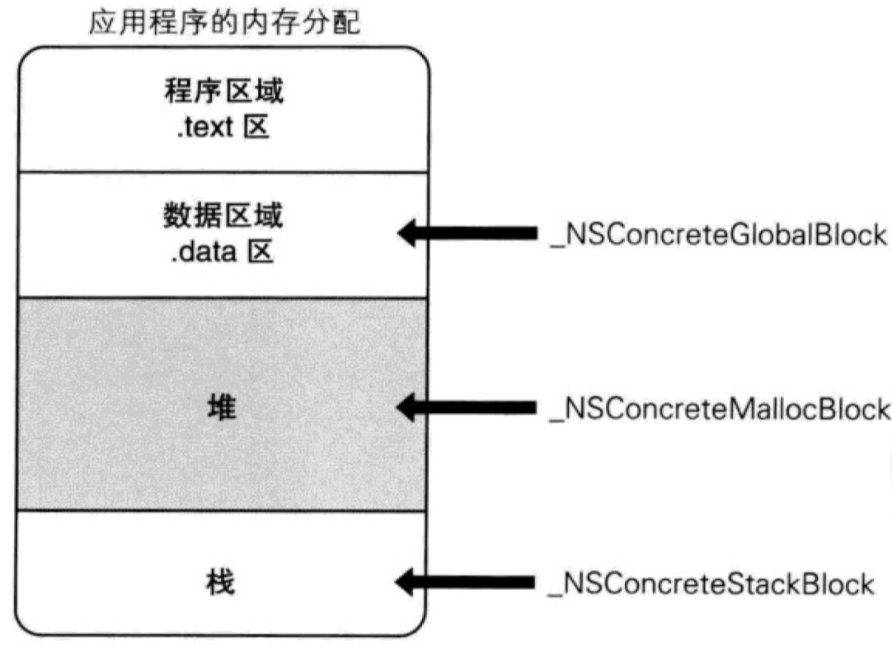

什么情况下 Block 为 `__NSConcreteGlobalBlock` 类对象：

- 声明全局变量的地方有 Block 语法
- Block 语法的表达式不使用应截获的自动变量

除此以外的 Block 语法生存的 Block 为 `__NSConcreteStackBlock` 类对象，且设置在栈上。

配置在全局变量上的 Block ，从变量作用域外也可以通过指针安全的使用。但设置在栈上的 Block ，如果其所属的变量作用域介绍，该 Block 就被废弃。由于 `__block` 变量也配置在栈上，同样地，如果其所属的变量作用域介绍，则该 `__block` 变量也会被废弃。如所示: 

#### 

### 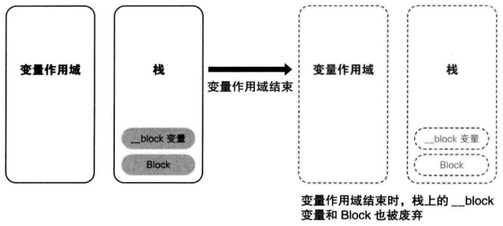

Block 提供了将 Block 和 `__block` 变量从栈上复制到堆上的方法，将配置在栈上的 Block 复制到堆上，这样即使 Block 记述的变量作用域结束，堆上的 Block 还可以继续存在。如图所示：

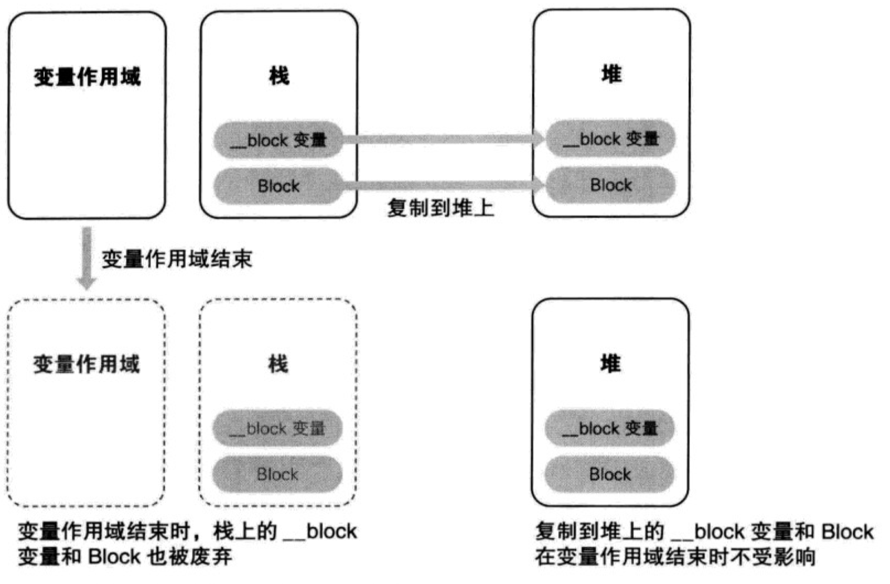

复制到堆上的 Block  将 `__NSConcreteMallocBlock` 类对象写入 Block 用结构体实例的成员变量 isa ：

```c
impl.isa = &__NSConcreteMallocBlock;	
```

而 `__block` 变量用结构体成员变量 `__forwarding` 可以实现无论 `__block` 变量配置在栈上还是堆上都能够正确地访问 `__block` 变量。

在 ARC 有效时，大多数情形下编译器会恰当地进行判断，自动生成将 Block 从栈上复制到堆上的代码：

```c
typedef int (^blk_t)(int);
btl_t func(int rate) 
{
	return ^(int count){return  rate * count; };
}
```

通过 ARC 的编译器可转换如下：

```c
bkt_t func(int rate)
{
	blk_t tmp = &__func_block_impl_0(
		__func_block_func_0, &__func_block_desc_0_DATA, rate);
		
		tmp = objc_retainBlock(tmp);
		
		return objc_autoreleaseReturnValue(tmp);
	)
}
```

在 ARC 处于有效的状态下，blk_t tmp 实际上与附有 `__strong`  修饰符的 blk_t __strong tmp 相同。

通过 objc4 运行时库的 runtime/objc-arr.mm 可知， objc_retainBlock 函数实际上就是 `_Block_copy` 函数：

```c
/* 
 * 将通过 Block 语法生成的 Block (栈上的 Block 结构体实例) 复制给 Block 类型的变量 tmp 中。
 */
tmp = _Block_copy(tmp);

/*
 * _Block_copy 函数将栈上的 Block 复制到堆上，复制后，将堆上的地址作为指针赋值给 tmp。
 */
return objc_autoreleaseReturnValue(tmp);

/*
 * 将堆上的 Block 作为 Objective-C 对象注册到 autoreleasepool 中，然后返回该对象。
 */
```

 **对于将 Block  从栈上复制到堆上，可以使用 `copy` 方法。** 以下情况需要手动调用 `copy` 方法将 Block 从栈上复制到堆上：

- 向方法或函数的参数重传递 Block时

对于以下方法或函数不用手动复制：

- Cocoa 框架的方法且方法名中含有 usingBlock 等时
- Grand Central Dispatch 的 API

按照配置 Block 的存储域，将 `copy` 方法进行复制的动作总结如下：

| Block 的类            | 副本源的配置存储域 | 复制效果     |
| --------------------- | ------------------ | ------------ |
| _NSConreteStackBlock  | 栈                 | 从栈复制到堆 |
| _NSConreteGlobalBlock | 程序的数据区域     | 什么也不做   |
| _NSConreteMallocBlock | 堆                 | 引用计数增加 |

不管 Block 配置在何处，用 `copy ` 方法复制都不会引起任何问题。在不确定时调用 `copy` 方法即可。

## 3.5 __block 变量存储域

 使用 `__block` 变量的 Block 从栈复制到堆上时，`__block` 变量的变化如下：

| __block 变量的配置存储域 | Block 从栈复制到堆时的影响  |
| ------------------------ | --------------------------- |
| 栈                       | 从栈复制到堆并被 Block 持有 |
| 堆                       | 被 Block 持有               |

若在 Block 中使用的 `__block` 变量，则当该 Block 从栈复制到堆时吗，使用的所有配置在栈上的 `__block` 变量也全部会复制到堆上。此时 Block  持有 `__block` 变量。`__block` 变量的复制过程如图所示：

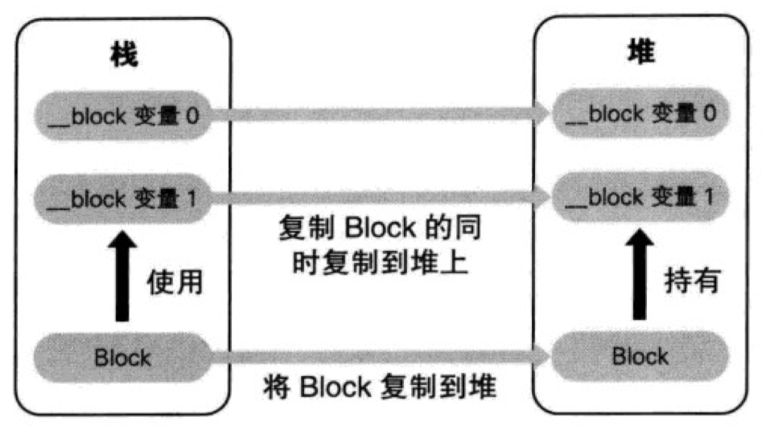

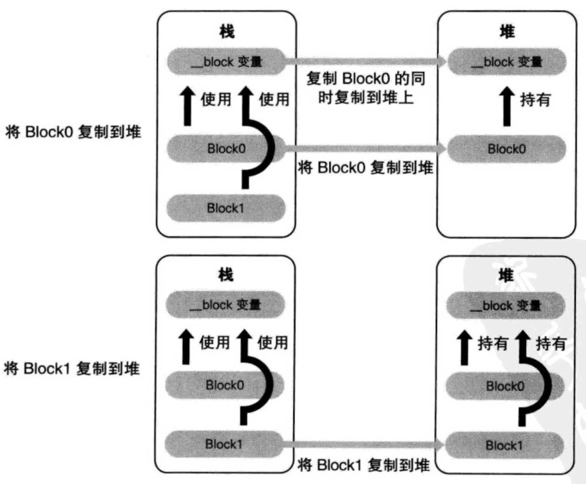

如果堆上的 Block 被废弃了，那么它所使用的 `__block`  变量也就被释放了：

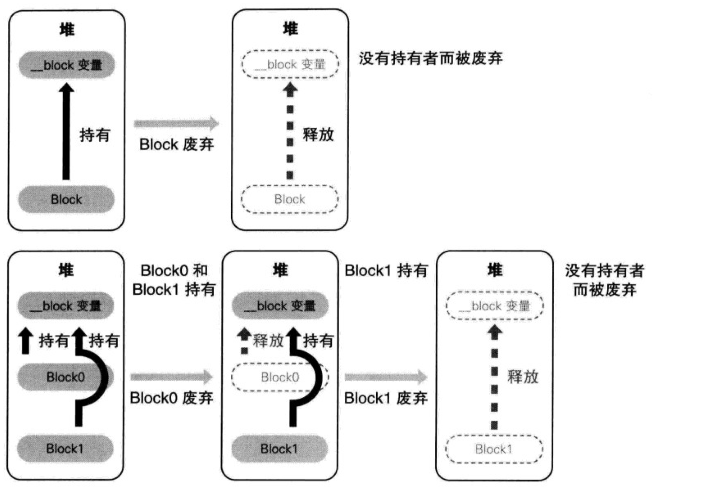

“不管 `__block` 变量配置在栈上还是在堆上，都能够正确地访问该变量 ” 这主要是通过 `__block` 变量的结构体成员变量 `__forwarding` 指针实现。通过 Block 的机制，`__block` 变量也从栈复制到堆，此时可同时访问栈上的 `__block` 变量和堆上的 `__block` 变量。

栈上的 `__block` 变量的结构体实例在 `__block` 变量从栈上复制到堆上时，会将成功变量 `__forwarding` 的值替换为复制目标堆上的 `__block` 变量的结构体实例的地址。如图所示：

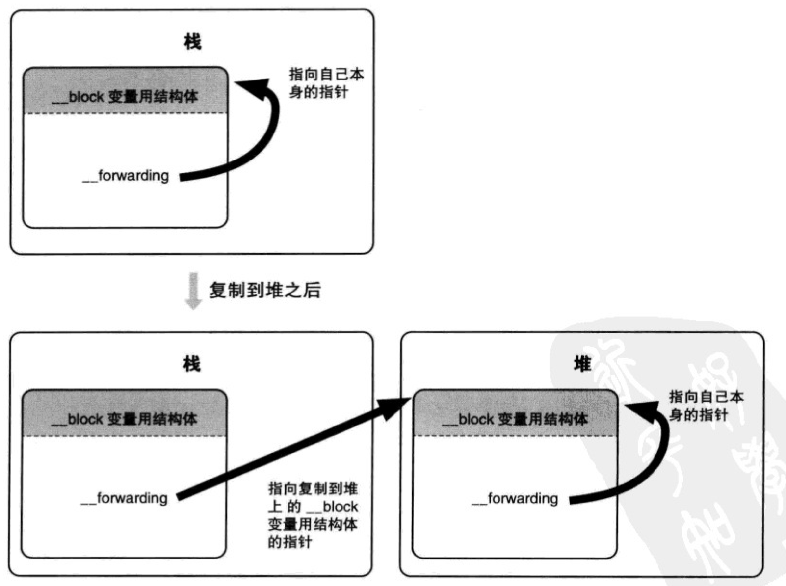

通过该功能，无论是在 Block 语法中，Block 语法外使用 `__block` 变量，还是 `__block` 变量配置在栈上或堆上，都可以顺利地访问同一个 `__block`变量。

### 3.6 截获对象

```objectivec
#import <Foundation/Foundation.h>

typedef int (^blk_t)(id obj);

blk_t blk;

int main(int argc, const char * argv[]) {
    @autoreleasepool {
        
        id array = [[NSMutableArray alloc] init];
        blk = [^(id obj) {
            [array addObject:obj];
            NSLog(@"array count = %ld", [array count]);
        } copy];
        
        blk([[NSObject alloc] init]);
        blk([[NSObject alloc] init]);
        blk([[NSObject alloc] init]);
    }
    return 0;
}

// array count = 1
// array count = 2
// array count = 3
```

源码转换可得：

```c
struct __main_block_impl_0 {
  struct __block_impl impl;
  struct __main_block_desc_0* Desc;
  id array; // id __strong array;
  __main_block_impl_0(void *fp, struct __main_block_desc_0 *desc, id _array, int flags=0) : array(_array) {
    impl.isa = &_NSConcreteStackBlock;
    impl.Flags = flags;
    impl.FuncPtr = fp;
    Desc = desc;
  }
};

static void __main_block_func_0(struct __main_block_impl_0 *__cself, id obj) {
  id array = __cself->array; // bound by copy

            ((void (*)(id, SEL, ObjectType _Nonnull))(void *)objc_msgSend)((id)array, sel_registerName("addObject:"), (id)obj);
            NSLog((NSString *)&__NSConstantStringImpl__var_folders_w3__4d54cwj0yd8bncq2cqrbm5w0000gn_T_main_2520bb_mi_0, ((NSUInteger (*)(id, SEL))(void *)objc_msgSend)((id)array, sel_registerName("count")));
        }

static void __main_block_copy_0(struct __main_block_impl_0*dst, struct __main_block_impl_0*src) {
  _Block_object_assign((void*)&dst->array, (void*)src->array, 3/*BLOCK_FIELD_IS_OBJECT*/);
}

static void __main_block_dispose_0(struct __main_block_impl_0*src) {
  _Block_object_dispose((void*)src->array, 3/*BLOCK_FIELD_IS_OBJECT*/);
}

static struct __main_block_desc_0 {
  size_t reserved;
  size_t Block_size;
  void (*copy)(struct __main_block_impl_0*, struct __main_block_impl_0*);
  void (*dispose)(struct __main_block_impl_0*);
} __main_block_desc_0_DATA = { 
  0, 
  sizeof(struct __main_block_impl_0), __main_block_copy_0, __main_block_dispose_0
};
```

在 Block 的结构体中附有 `__strong` 修饰符的成员变量(默认)。在 OC 中，C 语言结构体不能含有附有 `__strong`  修饰符的变量。因为编译器不知道应何时进行 C 语言结构体的初始化和废弃操作，不能很好地管理内存。

但是 Objective-C 的运行时库能够准确把握 Block 从栈复制到堆以及堆上的 Block 被废弃的时机，因此 Block 的结构体中即使使用 `__strong` 修饰符或 `__weak` 修饰符的变量。通过在 `__main_block_desc_0`   结构体中增加的成员变量 copy 和 dispose， 以及作为指针赋值给该成员变量的 `__main_block_copy_0` 函数和`__main_block_dispose_0` 函数， 可以恰当地进行初始化和销毁。

`__main_block_copy_0` 函数使用 `_Block_object_assign` 函数将对象类型赋值给 Block 的结构体的成员变量 array 中并持有该对象。

```c
static void __main_block_copy_0(struct __main_block_impl_0*dst, struct {
  _Block_object_assign((void*)&dst->array, (void*)src->array, 		3/*BLOCK_FIELD_IS_OBJECT*/);
}
```

`_Block_object_assign`  相当于 retain 实例方法的函数，将对象赋值在对象类型的结构体成员变量中。

另外，`__main_block_dispose_0` 函数使用 `_Block_object_dispose` 函数，释放赋值在 Block 用结构体成员变量 array 中的对象。

```c
static void __main_block_dispose_0(struct __main_block_impl_0*src) {
  _Block_object_dispose((void*)src->array, 3/*BLOCK_FIELD_IS_OBJECT*/);
}
```

`_Block_object_dispose` 函数相当于 release 实例方法的函数，释放赋值在对象类型的结构体成员变量中的对象。

**Block 从栈复制到堆时以及堆上的 Block 被废弃时会调用 copy 函数 和 dispose 函数**。整理如下：

| 函数         | 调用时机                |
| ------------ | ----------------------- |
| copy函数     | 栈上的 Block 复制到堆时 |
| dispose 函数 | 堆上的 Block 被废弃时   |

**什么时候栈上的 Block  会复制到堆上？**

- 调用 Block 的 copy 实例方法时
- Block 作为函数返回值时
- 将 Block 赋值给附有 `__strong` 修饰符 id 类型的类或者 Block 类型成员变量时
- 在方法名中含有 usingBlock 的 Cocoa 框架方法或 Grand Central Dispatch 的 API 中传递 Block  时

上述情况下栈上的 Block 被复制到堆上，其实可归结为 `_Block_copy` 函数被调用时 Block 从栈复制到堆。相对的，在释放赋值到堆上的 Block  后，谁都不持有 Block 而使其被废弃时调用 dispose 函数。相当于对象的 dealloc 实例方法。

截获对象时和使用 `__block` 变量时的不同：

| 对象         | BLOCK_FIELD_IS_OBJECT |
| ------------ | --------------------- |
| __block 变量 | BLOCK_FIELD_IS_BYREF  |

Block 使用对象类型自动变量时，除以下情形外，推荐调用 Block 的 copy 实例方法。

- Block 作为函数返回值返回时
- 将 Block 赋值给类的附有 `__strong` 修饰符的 id 类型或 Block 类型成员变量时
- 向方法名中含有 usingBlock 的 Cocoa 框架方法或 Grand Central Dispatch 的 API 中传递 Block  时

### `__block` 变量和对象

`__block` 说明符可指定任何类型的自动变量。下面指定用于 Objective-C 对象的 id 类型自动变量：

```objectivec
__block id obj = [[NSObject alloc] init];	
```

等价于：

```objectivec
__block id __strong obj = [[NSObject alloc] init];
```

### 

ARC 有效时，id 类型以及对象类型变量必定附加所有权修饰符，缺省为附有 `__strong` 修饰符的变量。

在使用 `_block` 变量为附有 `__strong` 修饰符的 id 类型或对象类型自动变量时， 当 `__block` 变量从栈上复制到堆上时，使用 `_Block_object_assign` 函数，持用赋值给 `__block` 变量的对象。当堆上 `__block` 变量被废弃时，使用 `_Block_object_dispose` 函数，释放赋值给 `__block` 变量的对象。

### 3.8 Block 循环引用

如果在 Block  中使用附有 `__strong ` 修饰符的对象类型自动变量，那么当 Block 从栈复制到堆时，该对象为 Block 所持有，这样容易引起循环引用。循环引用的出现原因如下图所示：

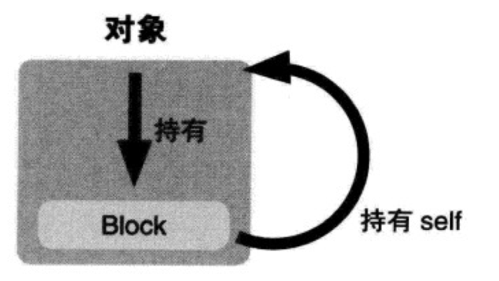

为了避免循环引用，可声明附有 `__weak` 修饰符的变量，并将 self 赋值使用：

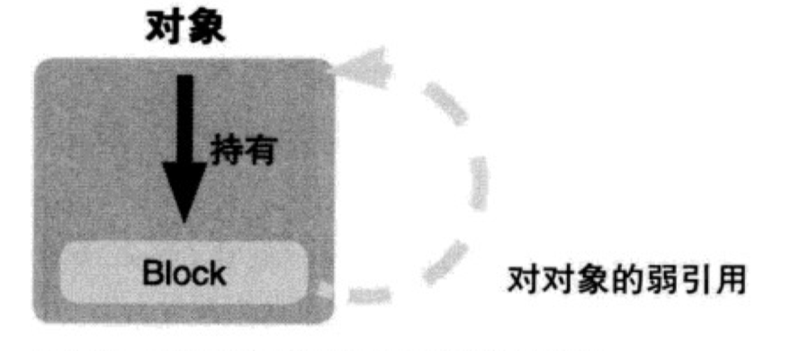

此外，还可以使用 `__block` 变量来避免循环引用。再使用 `__block` 变量来避免引用循环的过程中，需要调用一次 Block ，否则会出现以下情况：

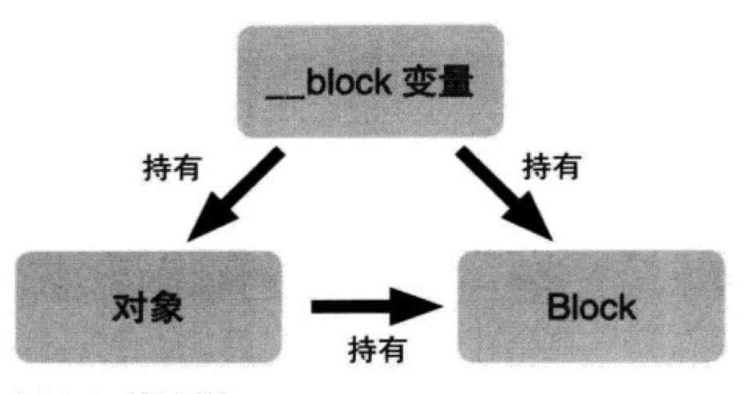

如果不执行 Block ，就会持续该循环应用从而造成内存泄露。通过执行 Block 实例方法， nil 被赋值在 `__block` 变量中，从而使 `__block` 变量对对象的强引用失效，从而结束引用循环。

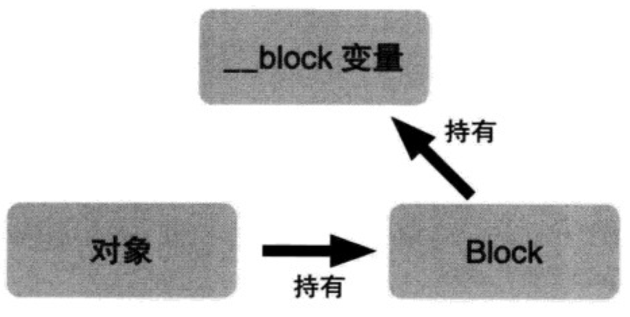

使用 `__block` 变量避免循环引用的方法和使用 `__weak` 修饰符以及 `__unsafe_unretained` 修饰符避免循环引用的比较：

使用 `__block` 变量的优点：

- 使用 `__block` 变量可控制对象的持有期间
- 在不能使用 `__weak` 修饰符的环境中不使用 `__unsafe_unretained` 修饰符即可。
- 在执行 Block 时可动态地决定是否将 nil 或 其他对象赋值在 `__block` 变量中。

使用 `__block` 变量的缺点：

- 为避免循环引用必须执行 Block

存在执行了 Block 语法，却不执行 Block 的路径时，无法避免循环引用。若由于 Block 引发了循环引用时，根据 Block 的用途选择使用 `__block` 变量、`__weak` 修饰符或 `__unsafe_unretained` 修饰符来避免循环引用。

## 3.9 copy / relase

ARC 无效时，需要手动将 Block 从栈复制到堆。另外，由于 ARC 无效，所以肯定要释放复制的 Block。这时需要用 copy 实例方法用来复制，用 release 实例方法来释放。

在 ARC 无效时，`__block`  说明符被用来避免 Block 中的循环应用。这是由于当 Block 从栈复制到堆时，若 Block 使用的变量为附有 `__block` 说明符的 id 类型或对象类型的自动变量，不会被 retain; 若 Block 使用的变量为没有 `__block` 说明符的 id 类型 或对象类型的自动变量，则被 retain。